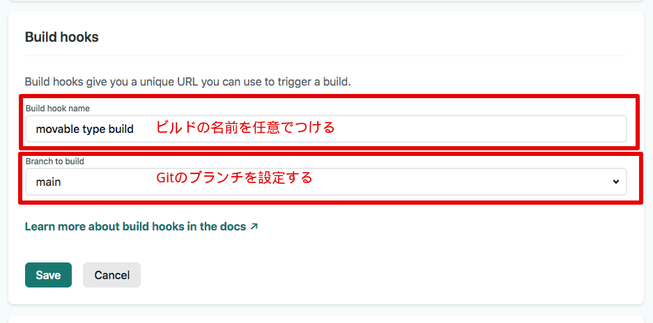
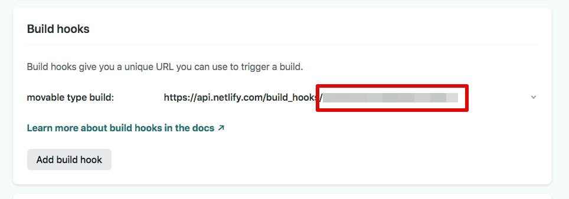

# mt-plugin-NetlifyBuildHooks

Netlify Build Hooksを設定できるMTプラグインになります。  
Jamstackな構成を想定しています。  

このプラグインで行えるのは、Netlify Build Hooks の実行を Movable Type から実行することが可能になるプラグインです。  
Movable Typeに用意されているテンプレート（MTML）を利用せず、React/Next.js/Gatsby.js/Vue.js/Nuxt.js/Gridsome/11tyなどを静的ジェネレーターとしてテンプレートをGitで管理しておきます。  
Netlifyのデプロイ時にデータの管理先となるMovable TypeをData APIで取得し必要のファイル生成をJavaScriptで行う形を想定しています。  

## Requirement

- Movable Type 7

## Installation

1. Unpack the mt-plugin-NetlifyBuildHooks archive.
1. Upload and copy the mt-plugin-NetlifyBuildHooks/plugins/NetlifyBuildHooks folder to your MT's plugins folder. ( /path/to/mt/plugins )

## How to use

### Setting

事前に、React/Next.js/Gatsby.js/Vue.js/Nuxt.js/Gridsome/11tyなどを静的ジェネレーターをセットアップは各フレームワークのドキュメントで行ってGitのリポジトリに設定しておきます。
また、Netlifyを利用するためアカウントの設定も事前に済ませておきましょう。

1. Netlifyにアクセスし設定したホスティング先の `Site settings` にアクセスします
1. Build hooksのセクションに移動します。
1. Build hook name を任意の名前で定義する
1. gitのブランチを指定（ターゲットとなるブランチでビルドを行います。）
1. 保存

1. 保存完了すると APIのURLが発行されます。
1. `https://api.netlify.com/build_hooks/` の後ろの値はMovable Type側で必要になるため保存

NetlifyBuildHooksプラグインのインストールは事前に済ませておきます。

1. 各自のMovable Typeにアクセスします。
1. NetlifyBuildHooksのプラグインは、サイト単位で設定するため各自のサイトへアクセスします。
1. サイトから左カラムの設定→プラグインをクリック
1. Netlify Build Hooks をクリック
1. Netlifyでコピーした値を開発環境か本番環境どちらかに設定します。
1. 保存します

開発環境と本番環境で2つ設定できます。  
開発でデプロイ確認などで利用する場合は、プレビュー確認用でも設定できます。

## License

The MIT License (MIT)
