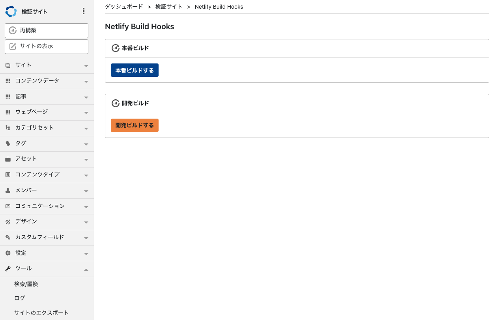

# mt-plugin-NetlifyBuildHooks

Netlify Build Hooksを設定できるMTプラグインになります。  
Jamstackな構成を想定しています。

React/Next.js/Gatsby.js/Vue.js/Nuxt.js/Gridsome/11tyなどのフレームワークを使いNetlifyのデプロイする前提の構成を想定しています。  
フレームワークでは、Movable TypeのData APIを fetchする形でデータを取得しデプロイ時に必要データを取得し静的なファイルを出力しておきます。  

このプラグインの設定に Netlify Build Hooks の `ID` を定義することで、MTの記事を更新したあとにビルドボタンを実行することで最新のMT DataAPIを取得しNetlify側でビルドを行ってくれます。

